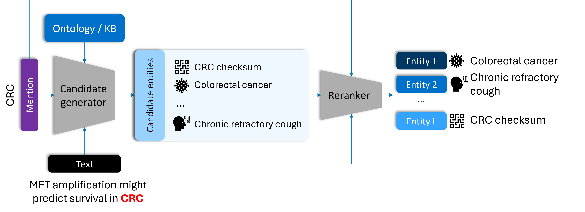

# Entity Extraction Tools and Experiments

Repository containing code for performing biomedical entity linking. This repository includes tools for performing
two-stage entity linking using cross-encoders. It includes accelerated second-step cross-encoders, capable of dealing with
multiple mention-candidate pairs simultaneously.

The core functionality is in the entitytools module in `entitytools/`. Scripts that run these are in `scripts/`. 
Below, you can find details about the scripts needed to perform basic entity linking.

## Table of Contents
1. [Framework](#framework)
2. [Datasets](#datasets)
3. [First stage entity-linking with n-grams](#ngrams)
4. [First stage entity-linking with SapBERT](#sapbert)
5. [Second stage entity-linking with cross-encoders](#cross)
6. [Evaluation](#eval)
7. [Citation](#cite)

## Framework <a name="framework"></a>

This framework contains the tools to perform two-stage biomedical entity linking. We provide an example of this architecture in the figure below.



The first stage of entity linking is **candidate retrieval**: given the complete set of entities, a candidate retrieval model provides a first filtering of entities to which a mention in a text might refer to. The second stage of entity linking is **reranking**. In this step, a more precise (but slow) algorithm sorts the retrieved entities to generate the final ranking of entities. The goal of entity linking is to provide the entity matching the mention on top of the ranking.

### Candidate retrieval models
- **n-grams:** retrieves those entities which have matching n-grams between the mention and the entity aliases.
- **SapBERT:** pre-trained bi-encoder that estimates the similarity between the mention and the entity.

### Reranker models
- **Cross-encoder:** Basic cross-encoder model for entity linking. Processes one mention-candidate pair at a time.
- **Accelerated cross-encoders:** Adaptations of the cross-encoder capable of processing multiple mention-candidate pairs simultaneously.
    - *Parallel cross-encoder:* Processes all candidates for a given mention simultaneously.
    - *Multi cross-encoder:* Processes all mention-candidate pairs in a sentence simultaneously.
    - *Passage cross-encoder:* Processes all mention-candidate pairs in a passage simultaneously.
    - *Document cross-encoder:* Processes all mention-candidate pairs in a passage simultaneously.


## Datasets <a name="datasets"></a>

While we do not provide the datasets, we include a script to download the datasets, and specific scripts to pre-process
and format the datasets for performing entity linking on them. 

In order to download the raw datasets, please, use the following command:
```commandline
bash ../scripts/fetch_corpora_sources.sh
```
Note that this download doesn't include the UMLS 2017AA ontology, as this ontology requires a license to access.

Once the data has been downloaded, for each dataset, we provide Python scripts to transform them into the BioC XML format
required by this library to perform entity linking. The commands for those scripts are as follows:

### Medmentions (full) and the UMLS 2017AA ontology
There are two scripts associated to the Medmentions (full) dataset: first, a script to prepare the dataset, and second, a script
to prepare the ontology (which must be downloaded separately).

The script for preparing the Medmentions dataset is the following:
```commandline
python ../scripts/prepare_medmentions.py --medmentions_dir corpora_sources/medmentions/full --out_train medmentions_full_train.xml.gz --out_val medmentions_full_val.bioc.xml.gz --out_test medmentions_full_test.bioc.xml.gz
```
where:
- `--medmentions_dir`: directory on which the MedMentions files are stored
- `--out_train`: output file where the training set shall be stored
- `--out_val`: output file where the validation set shall be stored
- `--out_test`: output file where the test set shall be stored

Then, the UMLS 2017 AA release should be processed as:
```commandline
python ../scripts/prepare_umls.py --umls /nfs/primary/umls/2017AA-full/META --out umls.json.gz
```
where:
- `--umls`: the directory containing the UMLS 2017AA-full ontology
- `--out`: the output file containing the ontology.

### Medmentions (st21pv) and the UMLS 2017AA ontology
There are two scripts associated to the Medmentions (st21pv) dataset: first, a script to prepare the dataset, and second,
a script to prepare the ontology (which must be downloaded separately).

The script for preparing the MedMentions dataset is the following:
```commandline
python ../scripts/prepare_medmentions.py --medmentions_dir corpora_sources/medmentions/st21pv --out_train medmentions_st21pv_train.xml.gz --out_val medmentions_st21pv_val.bioc.xml.gz --out_test medmentions_st21pv_test.bioc.xml.gz
```
where:
- `--medmentions_dir`: directory on which the MedMentions files are stored
- `--out_train`: output bioc.xml.gz file where the training set shall be stored
- `--out_val`: output bioc.xml.gz file where the validation set shall be stored
- `--out_test`: output bioc.xml.gz file where the test set shall be stored

We omit the description of the UMLS preparation script (see Medmentions full for more information).

### NCBI Disease & the MEDIC ontology
There is a single script associated to the NCBI Disease entity linking dataset, which prepares both the dataset and
the MEDIC ontology.
```commandline
python ../scripts/prepare_ncbi_disease_and_medic.py --ncbidisease_dir corpora_sources/NCBI-disease/ --ctd_medic_diseases corpora_sources/CTD_diseases.tsv.gz --out_train ncbidisease_train.bioc.xml.gz --out_val ncbidisease_val.bioc.xml.gz --out_test ncbidisease_test.bioc.xml.gz --out_ontology medic.json.gz
```
where:
- `--ncbidisease_dir`: directory on which the NCBI Disease dataset is stored
- `--ctd_medic_diseases`: tsv.gz file containing the MEDIC ontology
- `--out_train`: output bioc.xml.gz file where the training set shall be stored
- `--out_val`: output bioc.xml.gz file where the validation set shall be stored
- `--out_test`: output bioc.xml.gz file where the test set shall be stored
- `--out_ontology`: output json.gz file where the MEDIC ontology shall be stored.

### NLM-Chem and MeSH 2021 ontology
There is a single script associated to the NLM-Chem dataset.
```commandline
python ../scripts/prepare_nlmchem_and_mesh.py --nlmchem_dir corpora_sources/NLM-Chem --mesh2021_dir corpora_sources/mesh2021 --out_train nlmchem_train.bioc.xml.gz --out_val nlmchem_val.bioc.xml.gz --out_test nlmchem_test.bioc.xml.gz --out_ontology mesh2021.json.gz
```
where:
- `--nlmchem_dir`: directory on which the NLM-Chem dataset is stored
- `--mesh2021_dir`: directory containing the MESH 2021 ontology
- `--out_train`: output bioc.xml.gz file where the training set shall be stored
- `--out_val`: output bioc.xml.gz file where the validation set shall be stored
- `--out_test`: output bioc.xml.gz file where the test set shall be stored
- `--out_ontology`: output json.gz file where the MESH 2021 ontology shall be stored.

### BC5CDR and MeSH 2015 ontology
There is a single script associated to the BC5CDR dataset.

```commandline
python ../scripts/prepare_bc5cdr_and_mesh.py --bc5cdr_dir corpora_sources/CDR_Data/CDR.Corpus.v010516 --mesh2015_dir corpora_sources/mesh2015 --out_train bc5cdr_train.bioc.xml.gz --out_val bc5cdr_val.bioc.xml.gz --out_test bc5cdr_test.bioc.xml.gz --out_ontology mesh2015.json.gz
```
- `--bc5cdr_dir`: directory on which the BC5CDR dataset is stored
- `--mesh2015_dir`: directory containing the MESH 2015 ontology
- `--out_train`: output bioc.xml.gz file where the training set shall be stored
- `--out_val`: output bioc.xml.gz file where the validation set shall be stored
- `--out_test`: output bioc.xml.gz file where the test set shall be stored
- `--out_ontology`: output json.gz file where the MESH 2015 ontology shall be stored.

## First-stage entity linking with n-grams (candidate generation) <a name="ngrams"></a>

As a first step towards entity linking, we provide code for finding suitable candidates for each mention.
In particular, we provide code for running the n-grams algorithm. There are two modes of running this script:

### Hyper-parameter tuning
```commandline
python ../scripts/train_ngrams.py --mode tune --train_corpus dataset_train.bioc.xml.gz --val_corpus dataset_val.bioc.xml.gz --ontology umls.json.gz
```
where:
- `--mode`: value `tune` for tuning the hyperparameters.
- `--train_corpus`: a bioc.xml.gz file containing the training data.
- `--val_corpus`: a bioc.xml.gz file containing the validation data.
- `--ontology`: a json.gz file containing the ontology to use.


The hyperparameter sweep is stored using Weights and Biases ([wandb.ai](wandb.ai)).

### Training
```commandline
python ../scripts/train_ngrams.py --mode train --train_corpus corpora/medmentions/medmentions_train.bioc.xml.gz --val_corpus corpora/medmentions/medmentions_val.bioc.xml.gz --ontology umls.json.gz --params params.json --output_dir model_ngrams [--metric_file times.csv]
```
where:
- `--mode`: value `train` for training the model.
- `--train_corpus`: a bioc.xml.gz file containing the training data.
- `--val_corpus`: a bioc.xml.gz file containing the validation data.
- `--ontology`: a json.gz file containing the ontology to use.
- `--params`: a json file containing the hyperparameters of the model, indexed by the `ngrams` name. Hyperparameters include:
  - `ngram_range`: the range of n-values to consider in the n-gram selection
  - `max_features`: the maximum number of features to consider.
  - `min_df`: minimum number of documents on which a n-gram needs to appear.
  - `char_side`: the direction from which to start processing the n-grams
    - `front`: take the first k characters
    - `back`: take the last k characters
    - `separate`: take the first k/2 characters and the last k/2 characters, separately.
    - `together`: take the first k/2 characters and the last k/2 characters as a sequence.
  - `char_count`: the number of characters (k) of a mention/entity to use.
- `--output_dir`: the output directory on which to store the n-grams model
- `--metric_file` a file on which to store training times (optional)

### Applying n-grams
Once the model has been trained, it can be used to generate a ranking of candidates. This is done through a different 
script:
```commandline
python ../scripts/apply_ngrams.py --in_corpus data.bioc.xml.gz --out_corpus results.bioc.xml.gz --ngrams_model model_ngrams --ontology umls.json.gz [--metric_file times.csv]
```
where:
- `--in_corpus`: the bioc.xml.gz dataset we want to apply entity linking to (i.e. validation / test datasets)
- `--out_corpus`: the bioc.xml.gz file containing the candidates for each mention.
- `--ngrams_model`: the directory containing the trained n-grams model.
- `--ontology`: a json.gz file containing the ontology to use.
- `--metric_file` a file on which to store inference times (optional)

## First-stage entity linking with SapBERT (candidate generation) <a name="sapbert"></a>

In addition to n-grams, we provide code for applying a SapBERT bi-encoder as a first-stage candidate generator.
The sequence to apply this model is as follows. 

### Ontology vectors
First, the following script creates dense vectors for the entities in the ontology.
```commandline
python ../scripts/make_dense_vectors.py --ontology medic.json.gz --model_name 'cambridgeltl/SapBERT-from-PubMedBERT-fulltext' --out_vectors ontology_vectors.npy [--metric_file times.csv]
```
where:
- `--ontology`: json.gz file containing the ontology
- `--model_name`: the model name to use (`cambridgeltl/SapBERT-from-PubMedBERT-fulltext` for SapBERT)
- `--out_vectors`: file containing the vectors.
- `--metric_file` a file on which to store dense vector creation time (optional)


### Vector lookup
Second, we create a vector lookup from the training dataset.
```commandline
python ../scripts/make_dense_vector_lookup.py --train_corpus dataset_train.bioc.xml.gz --val_corpus dataset_val.bioc.xml.gz  --model_name 'cambridgeltl/SapBERT-from-PubMedBERT-fulltext' --vectors ontology_vectors.npy --output_file dataset_ontology_lookup.json.gz [--metric_file times.csv]
```
where:
- `--train_corpus`: bioc.xml.gz file containing the training data.
- `--val_corpus`: bioc.xml.gz file containing the validation data.
- `--model_name`: the model name to use (`cambridgeltl/SapBERT-from-PubMedBERT-fulltext` for SapBERT)
- `--vectors`: the file containing the ontology dense vectors.
- `--output_file`: json.gz file on which to store the vector lookup.

### Applying the bi-encoder model
Finally, we can apply the bi-encoder model to select candidates using the following command:
```commandline
python ../scripts/apply_ngrams.py --in_corpus dataset_test.bioc.xml.gz --out_corpus results.bioc.xml.gz --candidates_lookup dataset_ontology_lookup.json.gz --ontology ontology.json.gz [--metric_file times.csv]
```
where:
- `--in_corpus`: the bioc.xml.gz dataset we want to apply entity linking to (i.e. validation / test datasets)
- `--out_corpus`: the bioc.xml.gz file containing the candidates for each mention.
- `--candidates_lookup`: the json.gz file containing the dense vector lookup.
- `--ontology`: a json.gz file containing the ontology to use.

## Second-stage entity linking with cross-encoders (reranking) <a name="cross"></a>
As the second-stage reranker, we provide code for running different cross-encoders (read the paper in [Citation](#cite) for
more details):
- **Base cross-encoder:** Pointwise cross-encoder which estimates the score for a single mention-candidate pair within a sentence.
- **Parallel cross-encoder:** Cross-encoder that estimates on a single call the scores of several candidates for a single mention within a sentence.
- **Multi cross-encoder:** Cross-encoder that estimates on a single call the scores of all mention-candidate pairs within a sentence.
- **Passage cross-encoder:** Cross-encoder that estimates on a single call the scores of all mention-candidate pairs within a passage.
- **Document cross-encoder:** Cross-encoder that estimates on a single call the scores of all mention-candidate pairs within a document.


### Parameter tune a cross-encoder
First, we can tune the hyperparameters of a chosen cross-encoder. 
NOTE: this command is very time-consuming.
```commandline
python ../scripts/train_crossencoder.py --mode tune --train_corpus corpora/medmentions/medmentions_train.bioc.xml.gz --val_corpus corpora/medmentions/medmentions_val.bioc.xml.gz --ontology umls.json.gz --crosstype base --ngrams_model model_ngrams
```
where:
- `-- mode`: set parameter to `tune` for tuning the hyperparameters of the cross-encoder.
- `--train_corpus`: the bioc.xml.gz file containing the training data.
- `--val_corpus`: the bioc.xml.gz file containing the validation data.
- `--ontology`: the json.gz file containing the ontology
- `--crosstype`: the type of cross-encoder
  - `base` for the base cross-encoder
  - `parallel` for the parallel cross-encoder
  - `multi` for the multi cross-encoder
  - `passage` for the passage cross-encoder
  - `document` for the document cross-encoder
- `--ngrams_model`: the n-grams model to apply.

### Train a cross-encoder
Once the hyperparameters have been chosen, it is possible to train a cross-encoder.
```commandline
python ../scripts/train_crossencoder.py --mode train --train_corpus corpora/medmentions/medmentions_train.bioc.xml.gz --val_corpus corpora/medmentions/medmentions_val.bioc.xml.gz --ontology umls.json.gz  --crosstype base --ngrams_model model_ngrams --params params.json --output_dir model_crossencoder [--metric_file times.csv]
```
where:
- `-- mode`: set parameter to `tune` for tuning the hyperparameters of the cross-encoder.
- `--train_corpus`: the bioc.xml.gz file containing the training data.
- `--val_corpus`: the bioc.xml.gz file containing the validation data.
- `--ontology`: the json.gz file containing the ontology
- `--crosstype`: the type of cross-encoder
  - `base` for the base cross-encoder
  - `parallel` for the parallel cross-encoder
  - `multi` for the multi cross-encoder
  - `passage` for the passage cross-encoder
  - `document` for the document cross-encoder
- `--params`: a json file containing the hyperparameters. Hyperparameters appear under the `crosstype+crossencoder` tag. Hyperparameters include:
  - `top_k`: number of entities from the candidate selector to consider.
  - `learning_rate`: learning rate of the cross-encoder
  - `batch_size`: batch size of the cross-encoder.
- `--output_dir`: the directory on which to store the cross-encoder model.

### Apply a cross-encoder
Finally, we can apply a cross-encoder using the following command:
```commandline
python ../scripts/apply_reranker.py --in_corpus corpora/medmentions/medmentions_val.bioc.xml.gz --out_corpus results_val_crossencoder.bioc.xml.gz --ngrams_model model_ngrams --ontology umls.json.gz --reranker_model model_crossencoder --crosstype base [--metric_file times.csv]
```
where:
- `--in_corpus`: the bioc.xml.gz file containing the input data.
- `--out_corpus`: the bioc.xml.gz file in which the output rankings will be stored. 
- `--ngrams_model`: the n-grams model.
- `--ontology:`: the json.gz file containing the ontology.
- `--reranker_model`: the directory on which the reranker model is stored.
- `--crosstype`: the type of cross-encoder.
  - `base` for the base cross-encoder
  - `parallel` for the parallel cross-encoder
  - `multi` for the multi cross-encoder
  - `passage` for the passage cross-encoder
  - `document` for the document cross-encoder

## Evaluation <a name="eval"></a>

Finally, we can evaluate the effectiveness of the entity linking algorithms with the following script
```commandline
python ../scripts/evaluate.py --gold_corpus dataset.bioc.xml.gz --pred_corpus test.bioc.xml.gz --metric_file metrics.csv
```
where:
- `--gold_corpus`: bioc.xml.gz file containing the gold labels.
- `--pred_corpus`: bioc.xml.gz file containing the entity linking rankings after applying a model.
- `--metric_file`: a file to store the metrics.

## Citation <a name="cite"></a>

If you use this repository in your research / development, cite the following paper:

> J. Sanz-Cruzado, J. Lever. Accelerating Cross-Encoders in Biomedical Entity Linking. BioNLP 2025 and Shared Tasks workshop , co-located with the 63rd Annual Meeting of the Association for Computational Linguistics (ACL 2025). Vienna, Austria, July-August 2025.


